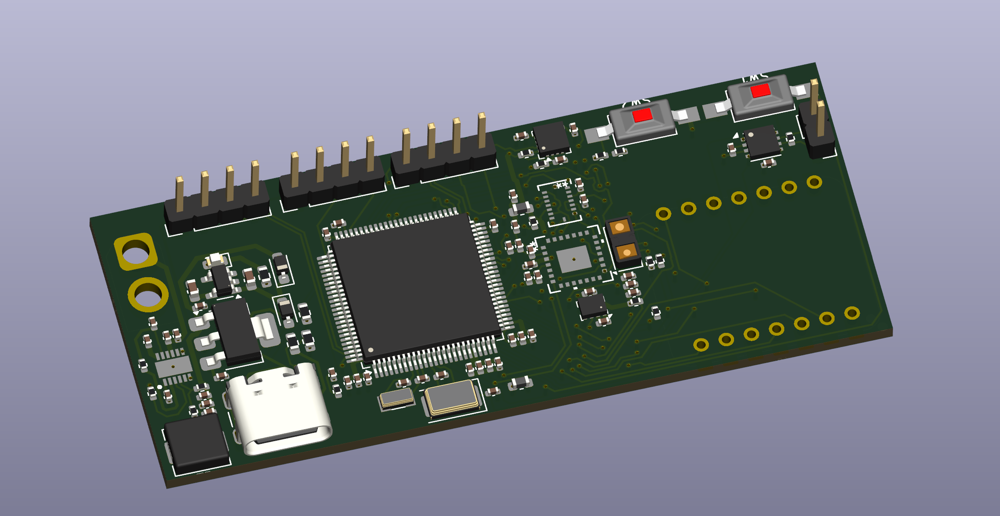
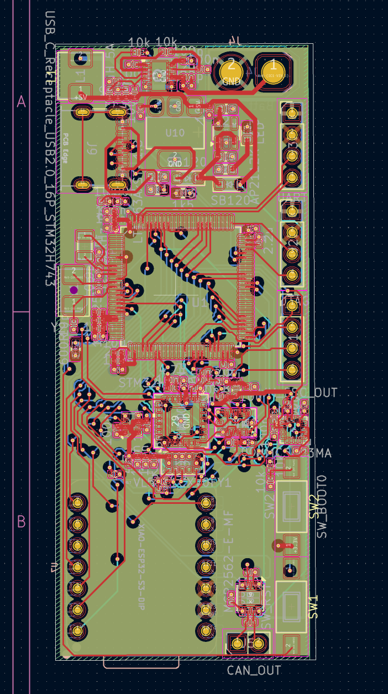
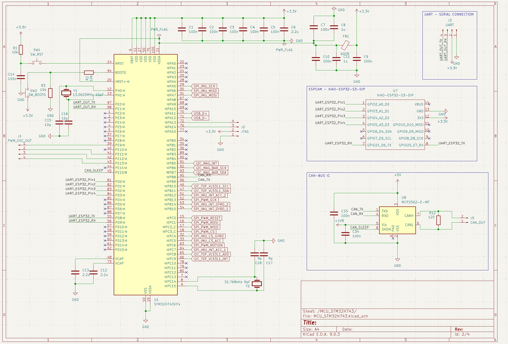
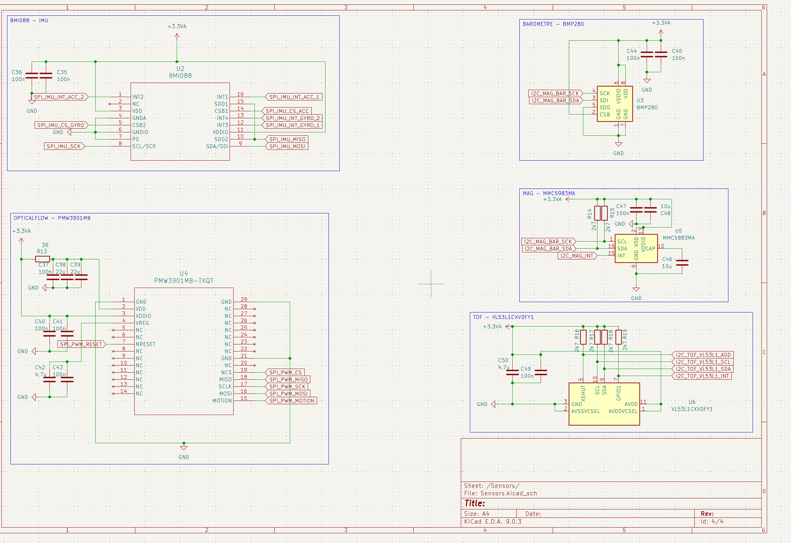
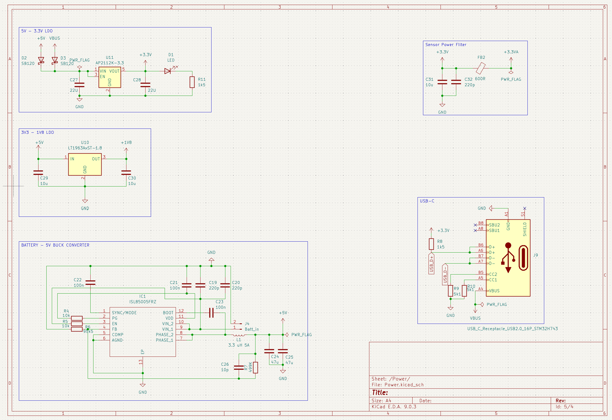

# Micro-Drone Flight Stack — STM32H743

A custom flight controller for a 3S micro-drone, designed from scratch: schematic, multi-layer PCB, and firmware.
The board is not a carrier for off-the-shelf modules — MCU, sensors, power tree and connectivity are all part of one design.

> **Status:** Rev 1 hardware design complete (KiCad 9). Firmware in development.

---

## 1. What this is

The goal is a **modular flight platform** that starts as a stabilised micro-drone and grows into an autonomous system: optical flow and ToF for indoor hold, GPS for outdoor navigation, and eventually a ROS 2 companion computer for SLAM.

Every stage is built and verified before the next one starts. This repository documents the hardware as designed and the firmware as it comes up.

**Why build the controller instead of using an off-the-shelf FC:** the interesting engineering is in the parts a commercial board hides — the analogue power path under a switching regulator, the sensor bus layout, the real-time task structure, and the failure behaviour when a link drops. Designing the board makes all of that visible and measurable.

---

## 2. Flight controller hardware (Rev 1)

### 2.1 Core

| Item | Part | Notes |
|---|---|---|
| MCU | **STM32H743VIT** | Cortex-M7, LQFP-100 |
| HSE crystal | 13.0625 MHz | with 10 pF load caps |
| LSE crystal | 32.768 kHz | RTC / low-speed domain |
| Debug | SWD/JTAG header (J2) | |
| Console | UART header (J3) | separate from the ESP32 link |
| USB | USB-C receptacle (J9) | USB 2.0 FS, CC1/CC2 with 5.1 kΩ sink resistors |

VCAP decoupling (2× 2.2 µF), bulk + local 100 nF per supply pin, and a **600 Ω ferrite on VDDA** to keep the ADC/analogue reference off the digital rail.

### 2.2 Sensors

| Function | Part | Bus | Notes |
|---|---|---|---|
| IMU | **Bosch BMI088** | SPI | separate accel/gyro dies, separate chip selects, 4 interrupt lines routed (2× accel, 2× gyro) |
| Barometer | **BMP280** | I²C | shared bus with magnetometer |
| Magnetometer | **MMC5983MA** | I²C | heading reference for yaw drift correction |
| ToF range | **VL53L1CXV0FY1** | I²C | altitude above ground, `XSHUT` + interrupt routed |
| Optical flow | **PMW3901MB-TXQT** | SPI | XY velocity estimation, dedicated RC-filtered supply (3 Ω + 100 nF/22 µF) and motion interrupt |

All sensors run from a **separately filtered +3.3VA rail** (ferrite from +3.3V), so switching noise from the regulators and the ESC lines does not land on the IMU supply. Interrupt-driven sampling is wired for both IMU dies rather than polling.

### 2.3 Power tree

```
Battery (3S) ──► ISL85005FRZ buck ──┬──► +5V ──► AP2112K-3.3 ──► +3.3V ──[FB 600Ω]──► +3.3VA (sensors)
                (3.3 µH / 5 A)      │
USB-C VBUS ─────[SB120]─────────────┘          +5V ──► LT1963A-1.8 ──► +1.8V (CAN transceiver I/O)
```

- **Schottky ORing (SB120)** between USB VBUS and the battery-derived 5 V, so the board can be powered and debugged over USB with the battery connected.
- **Buck first, LDO second:** the switching stage carries the current, the LDO cleans up the rail the MCU and sensors see. A single LDO from 3S would have to burn the whole difference as heat.
- Separate 1.8 V rail supplies the CAN transceiver's I/O reference.

### 2.4 Connectivity and expansion

| Interface | Detail |
|---|---|
| **ESC output (J1)** | 4× timer outputs to a 4-in-1 ESC (DShot) |
| **CAN (J5)** | MCP2562-E-MF transceiver, 120 Ω termination, `CAN_SLEEP` under MCU control |
| **ESP32-S3 socket (U7)** | XIAO ESP32-S3 DIP footprint on-board — UART + 4 GPIO, intended for camera / early vision experiments |
| **USB-C** | firmware update and host communication |

CAN is on the board deliberately: it is the bus this class of hardware talks to peripherals and companion boards with, and it makes the platform useful beyond a single airframe.

---

## 3. Gallery

<p align="center">
  
  
  
  
  
  <em>Flight controller</em>
</p>

---

## 4. Radio link and handheld transmitter

The current transmitter is built on an **ESP32-S3** with a custom RC protocol over **ESP-NOW** — arming, throttle limiting, failsafe, low-voltage scaling and buzzer control. Rev 1 is assembled and tested.

**Planned:** migration of the RC link to an **nRF54L15** handheld unit using ESB / a proprietary 2.4 GHz protocol, for lower latency and better link budget control.

Whatever the radio, the failsafe requirement is the same: loss of link must put the aircraft into a defined state, not an undefined one.

---

## 5. Firmware

Target architecture on **FreeRTOS**, STM32 HAL/LL:

- Interrupt-driven IMU sampling, pre-filtering, rate and angle estimation
- Complementary / Madgwick attitude filter
- Cascaded PID control (rate → angle, plus vertical control)
- Sensor fusion: IMU + barometer + ToF + optical flow
- Custom motor mixer with a DShot backend
- Failsafe handling and arming state machine

Separate tasks for control, sensing, telemetry and link handling, with queues at the boundaries.

---

## 6. Status

| Module | Status |
|---|---|
| Flight controller schematic (Rev 1) | ✅ Complete |
| Flight controller PCB layout | ✅ Complete |
| Board fabrication / assembly | 🟡 In progress |
| ESP32-S3 handheld transmitter | ✅ Rev 1 built and tested |
| IMU + barometer integration | ✅ Working |
| ToF + optical flow | 🟡 Partial |
| PID controllers | 🟡 Tuning |
| Magnetometer integration | 🔜 Planned |
| CAN interface bring-up | 🔜 Planned |
| nRF54L15 radio migration | 🔜 Planned |
| GPS (u-blox M10Q) | 🔜 Planned |
| CM5 companion / ROS 2 | 🔜 Planned |

---

## 7. Roadmap

**GPS integration (u-blox M10Q)** — UART + 1PPS sync, outdoor hold, integration into the global state estimator.

**Obstacle detection and local planning** — 8–10× VL53L7 ToF sensors in a 360° ring, local 3D bubble mapping, reactive path planning with direction-dependent speed limiting.

**Companion computer (CM5 + ROS 2)** — high-level navigation, SLAM / visual odometry, object detection and landing markers, MAVLink-style link between FC and companion.

**Early vision experiments (ESP32-S3)** — feature tracking and visual flow on the on-board module, before adding the CM5.

---

## 8. Repository layout

```
PCB_Design/   KiCad 9 project — schematic, layout, exports
Photos/       Renders, schematic captures and layout views
```

---

## 9. Tooling

KiCad 9.0.3 · STM32CubeIDE / CMake · FreeRTOS · Git · JTAG/SWD, logic analyser, oscilloscope

---

## License

To be added once the firmware source is published.
