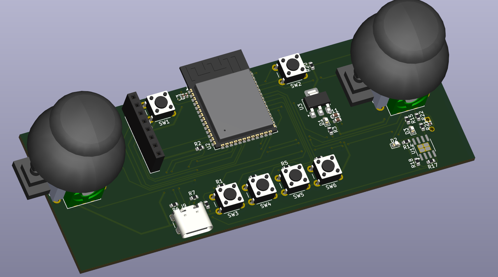
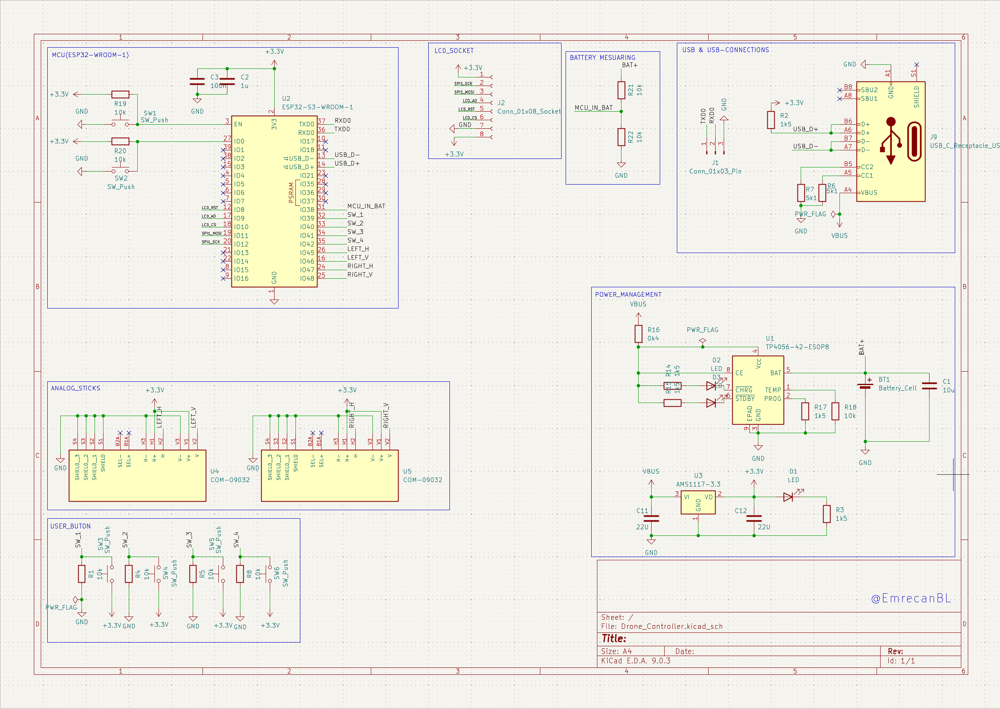
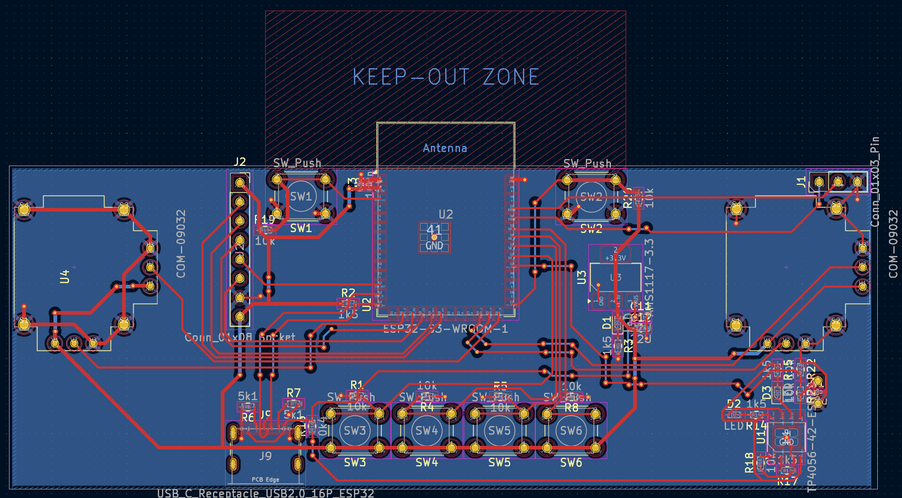
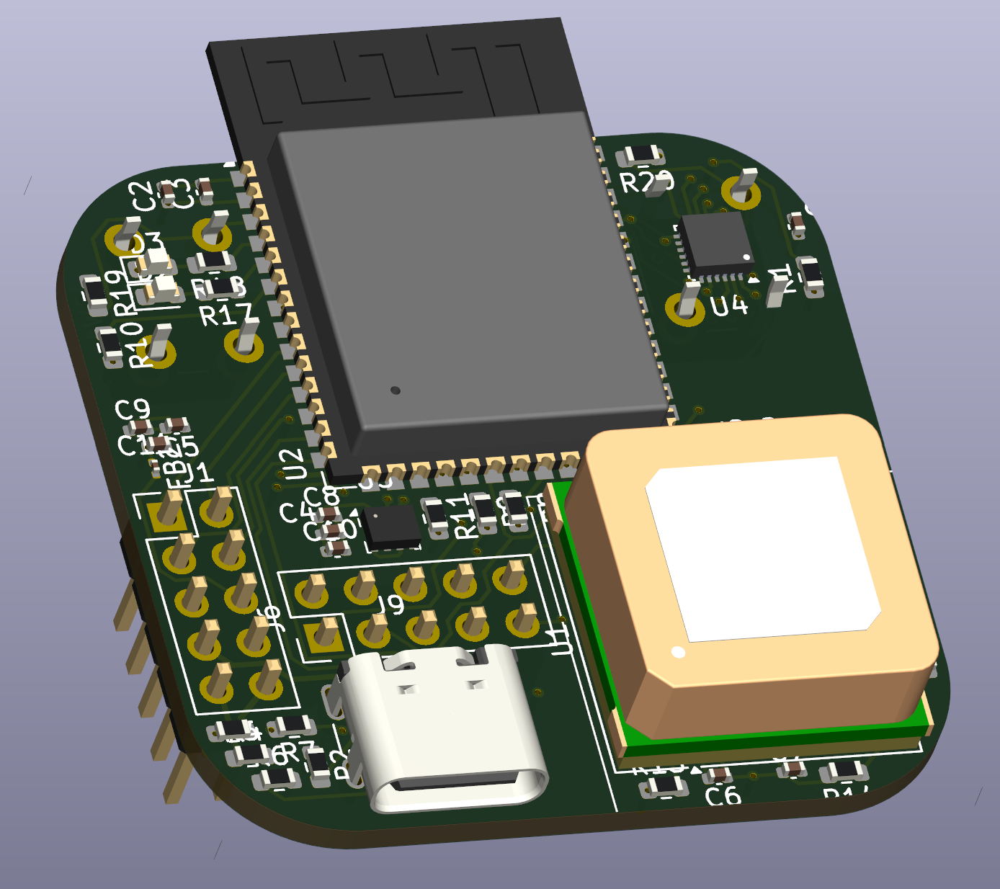
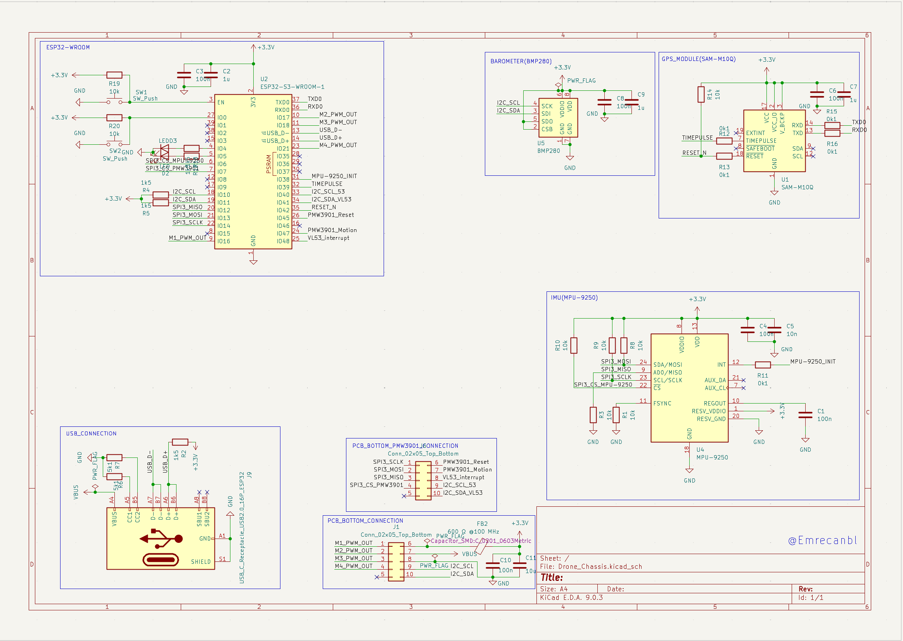
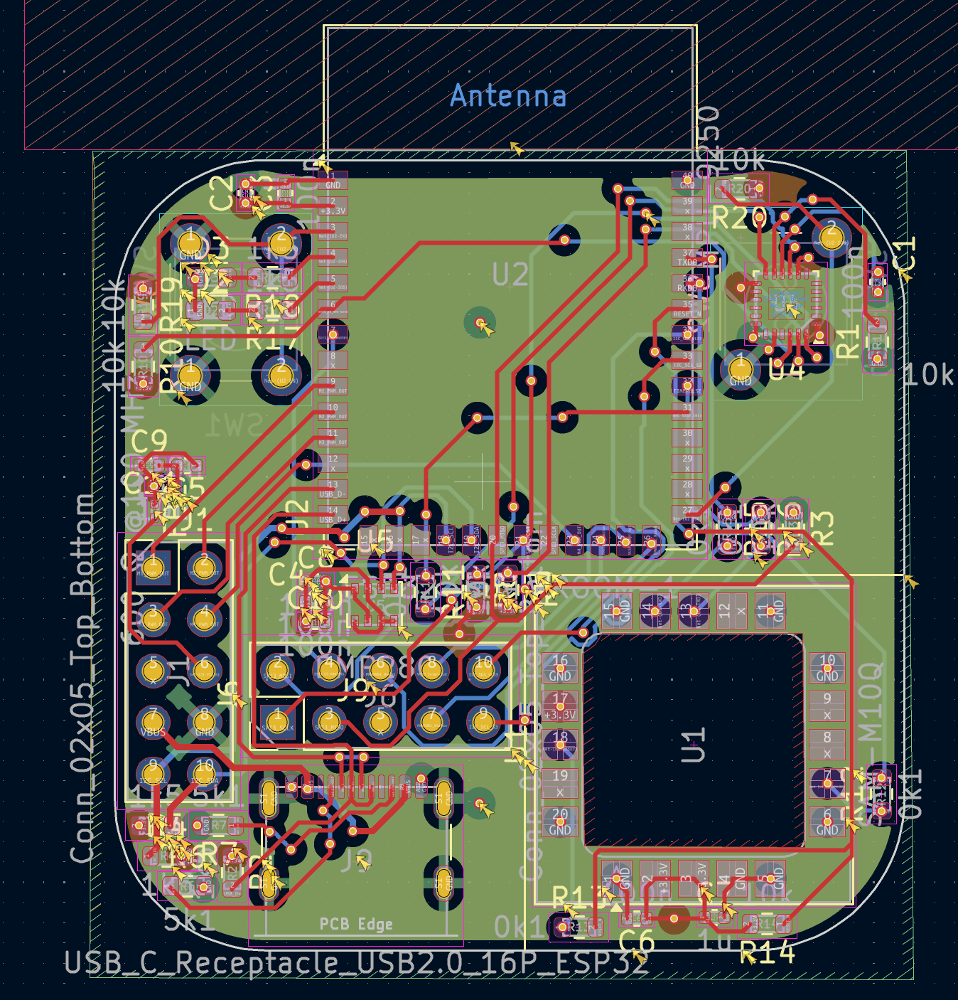
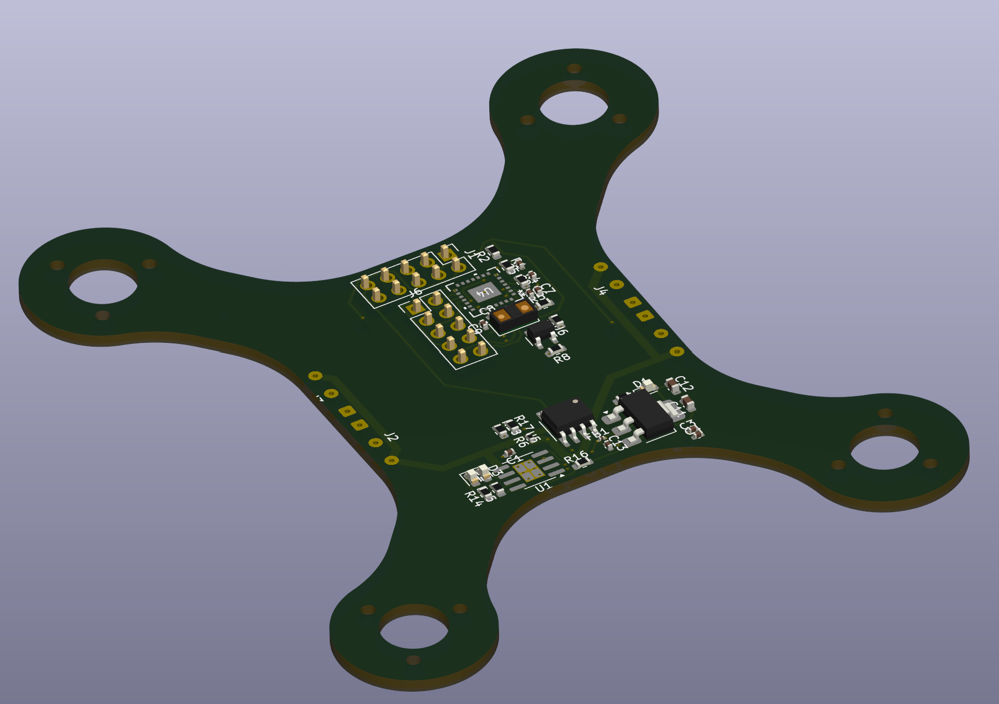
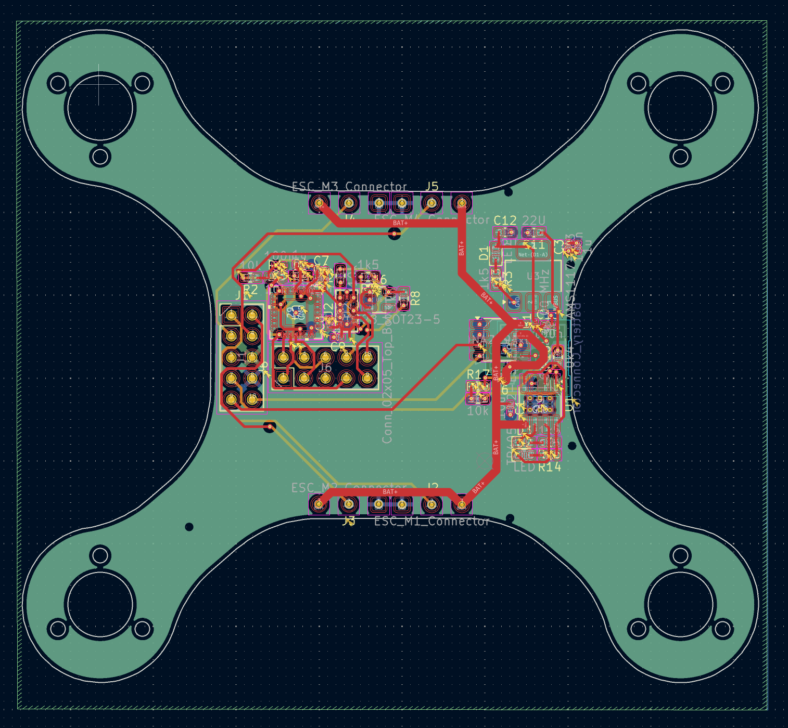
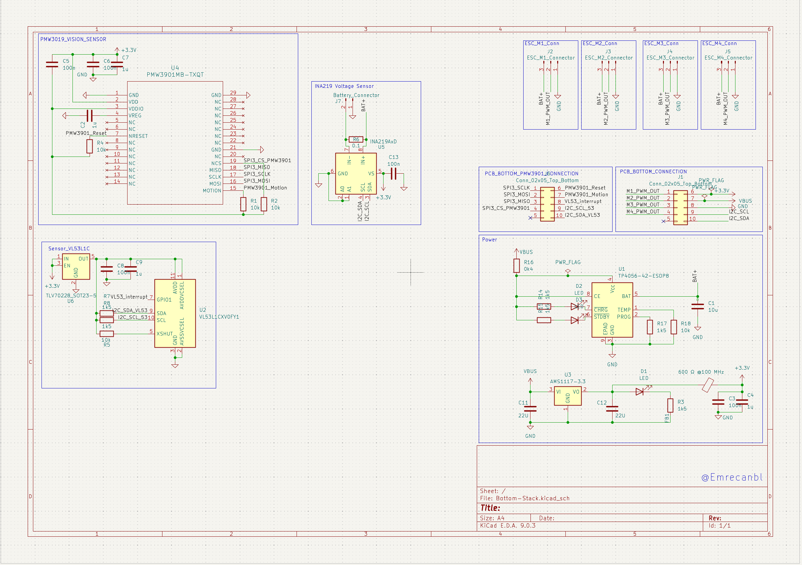

 ESP32-S3 Mini FC And Controller With ESP-NOW — Brushed + Optical Flow/ToF

**Low-cost indoor hover / position-hold platform based on ESP32-S3-WROOM-1.**

This repository contains the full stack for a three-board brushed quadcopter platform: the flight controller, the power distribution board, and the flow/ToF sensing board. The latest design spin now includes a fully routed PCB, schematic capture, and 3D model renders that make it easier to visualize the stack before fabrication.

---

## 📸 PCB Overview

The PCB design is now complete, with the schematic, layout, and mechanical model kept in sync. Use the renders below to explore the board before sending it to fabrication.

| Perspective | Image |
| --- | --- |
| Controller 3D Model |  |
| Controller Schematic |  |
| Controller Tracing |  |
| ESP32 FC 3D Model |  |
| ESP32 FC Schematic |  |
| ESP32 FC Tracing |  |
| Stack 3D Model |  |
| Stack Tracing |  |
| Bottom Board Schematic |  |

---

## ✨ Key Features

- **Flight MCU:** ESP32-S3-WROOM-1 running FreeRTOS / ESP-IDF firmware.
- **IMU:** MPU-9250 over I²C with dedicated quiet power island for low noise.
- **Barometer:** BMP280 on the shared I²C bus for altitude estimation.
- **Range / Flow (planned):** VL53L0X/L1X (I²C, 2.8 V) plus PMW3901 SPI flow sensor.
- **Power Telemetry:** INA219 high-side current/voltage + VBAT ADC for pack monitoring.
- **Brushed Drive:** Dual DRV8833 drivers supporting four 8520 coreless motors with 16–24 kHz PWM.
- **Connectivity / UI:** ESP-NOW radio link, USB‑C DFU, and an onboard low-voltage buzzer for failsafe alerts.
- **Mechanical Stack:** 3‑board sandwich — Top = PDB, Middle = FC, Bottom = Flow/ToF — optimized for 20×20 mm mounting.
- **Propellers:** Tuned for 55 mm bi‑blade (1.0 mm hub). Larger 65 mm props are possible with thermal monitoring.

---

## 🧱 Hardware Breakdown

### Board Status

| Board | Function | Rev | State |
| --- | --- | ---: | :-- |
| **FC (Controller)** | ESP32‑S3 + ST773 display, analog sticks, battery management | v1.0 | ✅ Ready for fabrication |
| **FC (Flight Core)** | ESP32‑S3 + MPU‑9250 + BMP280 + 2×DRV8833 + USB‑C + telemetry headers | v1.0 | ✅ Layout complete |
| **PDB (Top)** | VBAT entry, TVS + bulk caps, INA219 (0.01 Ω shunt, Kelvin), star power distribution | v0.x | 🛠️ In design |
| **Flow/ToF (Bottom)** | PMW3901 (SPI) + VL53L0X/L1X (I²C, 2.8 V LDO), downward apertures | v0.x | 🛠️ In design |

### Electrical & Grounding Strategy

- **Split grounds:** `GND_PWR` (PDB/drivers) and `GND_LOG` (MCU/sensors) meet at a single-point **0 Ω bridge** near the regulator for noise isolation.
- **IMU quiet island:** continuous ground below the IMU with `3V3_IMU` fed through a ferrite and decoupled by **10 µF + 1 µF + 0.1 µF**.
- **PDB entry filtering:** SMBJ14A TVS plus **680–1000 µF** low-ESR bulk capacitance at the battery pad, fanning out to each motor driver.

### Mechanical Notes

- **Mounting:** 20×20 mm M2 pattern with overall board outline ≈ 26×26 mm.
- **Stack-up:** Top = **PDB** → 6–8 mm standoffs → Middle = **FC** → 5–6 mm → Bottom = **Flow/ToF**.
- **Optics:** Flow and ToF modules look through **matte-black apertures** to suppress stray reflections.

---

## 📌 FC v1 Pinout (as built)

**SPI (shared bus)**

```
SCK  = GPIO36
MOSI = GPIO35
MISO = GPIO37
CS(IMU) = GPIO34
INT(IMU)= GPIO33
```

**I²C (INA219 + BMP280 + future VL53)**

```
SCL = GPIO9
SDA = GPIO8
Pull-ups: 4.7 kΩ; for VL53, pull to 2.8 V — ESP32 reads HIGH.
```

**Brushed PWM (LEDC, 16–24 kHz, 10–11-bit)**

```
M1 = GPIO3
M2 = GPIO4
M3 = GPIO5
M4 = GPIO6
DRV8833 single-ended: IN1 = PWM, IN2 = GND; OUT1/OUT2 → motor.
```

**Misc**

```
VBAT_ADC = GPIO1 (divider 1.00 MΩ / 470 kΩ + 0.1 µF)
BUZZER   = GPIO7 (NPN)
UART TX  = GPIO43
UART RX  = GPIO44
BOOT     = GPIO0
EN       = module EN
```

> Headers for future Flow (PMW3901) and ToF (VL53) are broken out on the FC. Final mapping for Flow/ToF is set on the bottom board; FC headers are pinned to match.

---

## 🧰 Core BOM

*(FC completed • others planned)*

- **MCU:** ESP32‑S3‑WROOM‑1 module.
- **IMU / Barometer:** MPU‑9250 (SPI) paired with BMP280 (I²C).
- **Brushed Drivers:** 2× DRV8833 with **0.1 µF** snubbers at each motor and optional **100 Ω + 10 nF** RC pads.
- **Telemetry:** INA219 plus **0.01 Ω 2512 (1–2 W)** high-side shunt (Kelvin connection) and VBAT divider.
- **Regulator:** 3V3 ≥ 1 A buck‑boost (e.g., **TPS63070** / **MPM3610-3V3**) for 1S packs.
- **Protection / IO:** USB‑C with 2×5.1 kΩ CC, D± ESD protection, **TVS on VBAT**, and generous bulk caps on the PDB.
- **Flow / Range (planned):** PMW3901 SPI flow module plus VL53L0X/L1X with **2.8 V LDO** (TLV70228 / AP7331-2.8).

> **Estimated full stack cost (brushed + flow + ToF):** **€45–60**

---

## 🧪 Firmware Targets (FreeRTOS)

- `imu_task` **1 kHz** (SPI DMA, DLPF)
- `attitude_task` **500–1000 Hz** (Madgwick/Mahony)
- `alt_hold_task` **100 Hz** (VL53 → Z PID)
- `flow_task` **100–200 Hz** (PMW3901 → vx, vy ≈ flow_rate × height)
- `pos_xy_task` **50–100 Hz** (XY PID, 5–10 Hz LPF on flow)
- `mixer_task` **500 Hz** (LEDC PWM)
- `rx_task` **200–300 Hz** (ESP‑NOW), failsafe **50–100 ms** → motor cut
- `power_task` **50–100 Hz** (INA219 + VBAT)

## 🚀 Getting Started

### Hardware Bring-up

1. Assemble the **FC v1** board and verify continuity on the power sections.
2. Connect **4× 8520** brushed motors to the **DRV8833** outputs with short twisted pairs.
3. Route **VBAT** through the **PDB** (or a bench supply) and confirm 3V3 regulation before mounting sensors.

### First Power-On Checklist

- Power-up **without props**; verify USB serial connectivity, IMU/BMP/INA219 I²C responses, and PWM outputs.
- Calibrate **IMU & barometer**, and confirm **VBAT** reading accuracy.
- Install propellers, configure a **throttle limit**, and perform a **short tethered hover** for thermal and control validation.
- Once the bottom sensing board is available, enable **ToF altitude-hold** followed by **flow-based XY-hold**.

---

## 🛠 Build & Layout Notes

- **EDA:** KiCad 7/8 (`/hardware`).
- **Fabrication:** 1.6 mm FR‑4; prefer **2 oz copper** or **1 oz** with top/bottom pours plus dense via stitching.
- **Optics (bottom board):** paint the aperture interior matte black to minimize reflections.
- **Cabling:** twist motor power pairs and keep signal lines short over a solid reference plane.
- **Calibration:** perform magnetometer hard/soft-iron calibration (figure‑8), ToF offset measurement, and flow scale tuning versus altitude.

---

## ✅ Test Plan (summary)

- **No-prop smoke test:** Monitor 3V3 ripple, PWM edges (pre/post series-R), and TVS/bulk behavior.
- **Tethered step response:** Command ±10° and record overshoot/settling time.
- **Alt-hold (ToF):** Validate before enabling **XY-hold (Flow)**.
- **Thermals:** 60 s @ 50 % throttle; log DRV8833 and bulk capacitor temperatures.
- **EMI scan:** Capture IMU spectral data; try PWM **16↔24 kHz** and adjust snubbers if needed.

---
